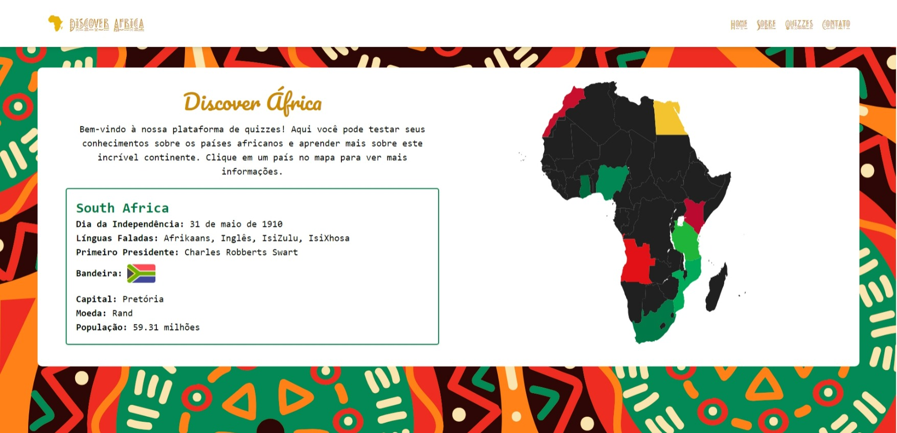
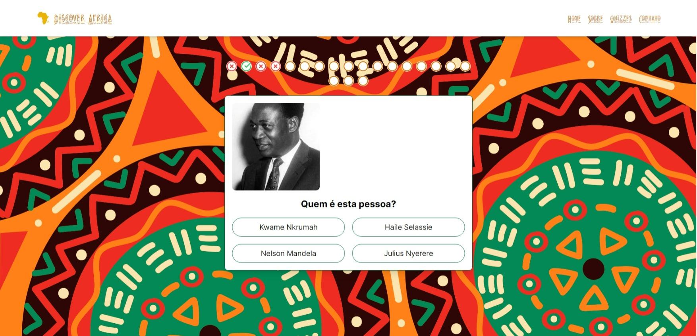
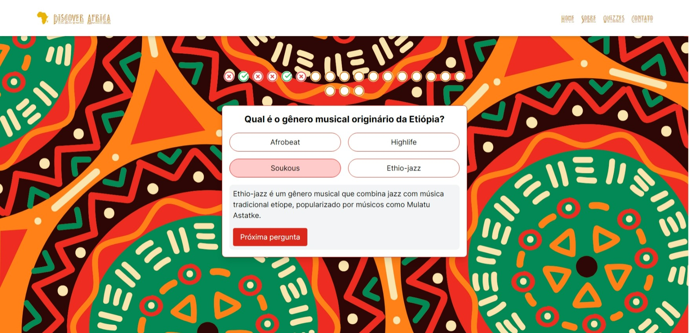

## Jogo de Quiz Discover Africa

### Visão Geral

Discover Africa é um jogo de quiz interativo projetado para testar e expandir seu conhecimento sobre o continente africano. O jogo inclui perguntas sobre diversos tópicos, como história, geografia, cultura e figuras notáveis. Os jogadores são apresentados com perguntas e respostas de múltipla escolha, algumas das quais incluem imagens para maior engajamento.

### Funcionalidades

- **Perguntas e Opções Embaralhadas**: Cada sessão apresenta perguntas e opções em uma ordem diferente para manter o jogo desafiador e novo.
- **Feedback nas Respostas**: Os jogadores recebem feedback imediato sobre se sua resposta está correta ou incorreta, juntamente com uma explicação.
- **Rastreamento de Progresso**: O jogo rastreia visualmente seu progresso, mostrando quais perguntas foram respondidas corretamente ou incorretamente.
- **Efeitos Sonoros**: Respostas corretas e incorretas acionam efeitos sonoros distintos para uma experiência imersiva.

### Instalação

1. **Clone o Repositório**:
   ```bash
   git clone https://github.com/EdilsonRogerioCuambe/discover-africa.git
   cd discover-africa
   ```

2. **Instale as Dependências**:
   ```bash
   npm install
   ```

3. **Execute a Aplicação**:
   ```bash
   npm run dev
   ```

4. **Abra Seu Navegador**:
   Navegue até `http://localhost:3000` para começar a jogar.

### Uso

1. **Comece o Jogo**:
   Abra a página inicial para começar o quiz. Você verá uma mensagem de boas-vindas e a primeira pergunta.

2. **Responda às Perguntas**:
   Clique nas opções para responder às perguntas. Se a pergunta incluir uma imagem, ela será exibida acima do texto da pergunta.

3. **Veja o Feedback**:
   Após selecionar uma opção, você receberá um feedback imediato indicando se a resposta estava correta ou incorreta, juntamente com uma explicação.

4. **Rastreie Seu Progresso**:
   A barra de progresso no topo da tela mostrará círculos verdes, vermelhos ou amarelos indicando perguntas corretas, incorretas e não respondidas, respectivamente.

5. **Avance para a Próxima Pergunta**:
   Clique no botão "Próxima Pergunta" para passar para a próxima pergunta no quiz.

### Capturas de Tela

#### Página Inicial



#### Pergunta com Imagem



#### Rastreamento de Progresso



### Tecnologias Utilizadas

- **Next.js**: Framework para renderização do lado do servidor e geração de sites estáticos.
- **React**: Biblioteca JavaScript para construção de interfaces de usuário.
- **TypeScript**: Superset do JavaScript para tipagem estática.
- **Tailwind CSS**: Framework CSS utilitário para estilização.
- **Framer Motion**: Biblioteca para animações.
- **Howler.js**: Biblioteca para reprodução de áudio.

### Melhorias Futuras

- **Mais Perguntas**: Expandir o banco de perguntas para cobrir mais tópicos e países.
- **Modo Multijogador**: Implementar um recurso para que os jogadores possam competir entre si em tempo real.
- **Leaderboard**: Adicionar um leaderboard para rastrear pontuações altas e encorajar a competição.

### Contribuindo

1. **Faça um Fork do Repositório**:
   Clique no botão "Fork" no canto superior direito da página do repositório para criar uma cópia do repositório na sua conta do GitHub.

2. **Clone Seu Fork**:
   ```bash
   git clone https://github.com/EdilsonRogerioCuambe/discover-africa.git
   cd discover-africa
   ```

3. **Crie uma Branch**:
   ```bash
   git checkout -b nome-da-branch
   ```

4. **Faça Suas Alterações**:
   Implemente seu recurso ou correção de bug.

5. **Comite Suas Alterações**:
   ```bash
   git add .
   git commit -m "Adicione algum recurso"
   ```

6. **Faça Push para Seu Fork**:
   ```bash
   git push origin nome-da-branch
   ```

7. **Abra um Pull Request**:
   Vá até a página do repositório no GitHub e abra um pull request a partir do seu fork.

### Licença

Este projeto está licenciado sob a Licença MIT. Veja o arquivo LICENSE para mais detalhes.
